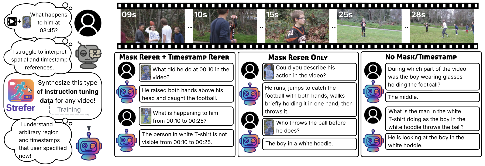
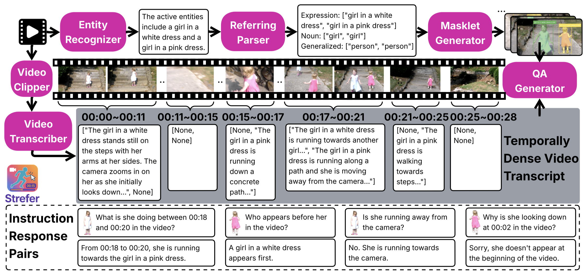

# Strefer: Empowering Video LLMs with Space-Time Referring and Reasoning via Synthetic Instruction Data

**[Salesforce AI Research](https://www.salesforceairesearch.com/)**

[Honglu Zhou](https://sites.google.com/view/hongluzhou/), [Xiangyu Peng](https://xiangyu-peng.github.io/), [Shrikant Kendre](https://www.linkedin.com/in/skendre), [Michael S. Ryoo](http://michaelryoo.com/), [Silvio Savarese](https://www.linkedin.com/in/silvio-savarese-97b76114/), [Caiming Xiong](http://cmxiong.com/), [Juan Carlos Niebles](https://www.niebles.net/)


## Highlights 🌟

This is the repository for our paper **Strefer: Empowering Video LLMs with Space-Time Referring and Reasoning via Synthetic Instruction Data**. 

<div align=center>
  
</div>
<br>

**Strefer** is a data engine that synthesizes instruction-response pairs through a scalable, grounded approach that enhances fine-grained spatial and temporal perception and reasoning over videos for tuning Video LLMs.

By design, **Strefer** generates instruction-response pairs—requiring no legacy annotations—based on its pseudo-annotated video metadata. It automatically clips the video into segments and pseudo-annotates the video metadata, including active entities, their locations (as masklets), and action timelines, for complex video scenarios, such as scenes containing multiple entities of the same category, and cases where entities do not appear in the first frame, or temporarily exit and re-enter the frame.

<div align=center>
  
</div>
<br>

**Strefer** enhances the ability of Video LLMs to interpret spatial and temporal references, fostering more versatile, space-time-aware reasoning essential for real-world AI companions.


 
## Code for Referring Masklet Generation 💻

Our novel **Referring Masklet Generation Pipeline** is a key module within **Strefer**. This pipeline produces tracked segmentation masks from videos with complex structures based on multi-word natural language referring expressions. 


Our referring masklet generator is carefully crafted to address key limitations overlooked by prior works by orchestrating complementary strengths of the state-of-the-art pixel-level vision foundation models to achieve more effective results. The code has been released; for detailed installation and usage guidelines, please refer to [this README](data-engine/referring-masklet-generator).

## License 💼
Our code, data, and models are released for research-only, non-commercial purposes under a CC-BY-NC 4.0 license. Users are responsible for making their own assessment of any obligations or responsibilities under the corresponding licenses or the terms and conditions applicable to the original code, data, and model weights.


## Citation 📝
Please cite us if you find our work helpful. Thank you! 🥰🙏💖
```bibtex
@article{zhou2025strefer,
  title={Strefer: Empowering Video LLMs with Space-Time Referring and Reasoning via Synthetic Instruction Data},
  author={Zhou, Honglu and Peng, Xiangyu and Kendre, Shrikant and Ryoo, Michael S. and Savarese, Silvio and Xong, Caiming and Niebles, Juan Carlos},
  journal={arXiv preprint arXiv:2509.03501},
  year={2025}
}
```
*Stay tuned for more releases coming soon!*
