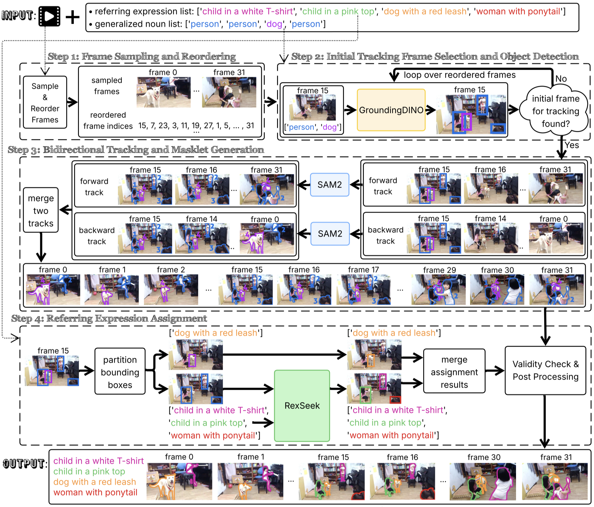

# Referring Expression to Tracked Segmentation Masks

**[Salesforce AI Research](https://www.salesforceairesearch.com/)**

[Honglu Zhou](https://sites.google.com/view/hongluzhou/), [Xiangyu Peng](https://xiangyu-peng.github.io/), [Shrikant Kendre](https://www.linkedin.com/in/skendre), [Michael S. Ryoo](http://michaelryoo.com/), [Silvio Savarese](https://www.linkedin.com/in/silvio-savarese-97b76114/), [Caiming Xiong](http://cmxiong.com/), [Juan Carlos Niebles](https://www.niebles.net/)


<div align=center>
  
</div>


## Highlights 🌟

This is code for our novel **Referring Masklet Generation Pipeline** within **Strefer**. This pipeline produces **tracked segmentation masks from videos** with complex structures based on **multi-word natural language referring expressions**. 

Our pipeline robustly handles challenging scenarios, including multiple same- or similar-category entities described differently, entities absent in the first frame, and entities that temporarily exit and re-enter the scene. It is carefully crafted to address key limitations overlooked by prior works by orchestrating complementary strengths of the state-of-the-art pixel-level vision foundation models, including [Grounding DINO](https://arxiv.org/abs/2303.05499), [SAM 2](https://arxiv.org/abs/2408.00714) and [RexSeek](https://arxiv.org/abs/2503.08507).

## Contents 📖
- [Installation](#installation-%EF%B8%8F)
- [Demo](#demo-)

## Installation ⚙️
### Step 1: 
```bash
git clone --recurse-submodules https://github.com/SalesforceAIResearch/strefer.git
cd strefer
```
### Step 2: Install [Grounded SAM 2](https://github.com/IDEA-Research/Grounded-SAM-2/tree/main?tab=readme-ov-file#installation)
While we recommend following their [official installation guidelines](https://github.com/IDEA-Research/Grounded-SAM-2/tree/main?tab=readme-ov-file#installation), the steps we followed are outlined below for reference:

Download the pretrained `SAM 2` checkpoints:
```bash
cd data-engine/referring-masklet-generator/Grounded-SAM-2/checkpoints
bash download_ckpts.sh
```

Download the pretrained `Grounding DINO` checkpoints:
```bash
cd data-engine/referring-masklet-generator/Grounded-SAM-2/gdino_checkpoints
bash download_ckpts.sh
```

Create a conda environment `grounded-sam-2`:
```bash
conda create -n grounded-sam-2 python=3.10 -y
conda activate grounded-sam-2
```

Install `cuda-12.1`:
```bash
conda install -c nvidia/label/cuda-12.1.0 cuda-toolkit
echo $CONDA_PREFIX
export CUDA_HOME=$CONDA_PREFIX
export PATH=$CUDA_HOME/bin:$PATH
export LD_LIBRARY_PATH=$CUDA_HOME/lib:$LD_LIBRARY_PATH
which nvcc
# return: /path/to/miniconda3/envs/grounded-sam-2/bin/nvcc
echo $CUDA_HOME
# return: /path/to/miniconda3/envs/grounded-sam-2
```

Install `PyTorch`:
```bash
conda install pytorch==2.3.1 torchvision==0.18.1 pytorch-cuda=12.1 -c pytorch -c nvidia
```

Install `Segment Anything 2`:
```bash
cd data-engine/referring-masklet-generator/Grounded-SAM-2
pip install -e .
```

Install `Grounding DINO`:
```bash
cd data-engine/referring-masklet-generator/Grounded-SAM-2
pip install --no-build-isolation -e grounding_dino
```

Install other packages:
```bash
pip install supervision
pip install pycocotools
pip install transformers
pip install joblib
```
### Step 3: Install [RexSeek](https://github.com/IDEA-Research/RexSeek?tab=readme-ov-file#2-installation-%EF%B8%8F)
Again, we recommend following their [official installation guidelines](https://github.com/IDEA-Research/RexSeek?tab=readme-ov-file#2-installation-%EF%B8%8F), but the steps we followed are outlined below for reference:

Create and set up a conda environment `rexseek`:

```bash
conda create -n rexseek python=3.10
conda activate rexseek
export CUDA_VISIBLE_DEVICES=0
conda install pytorch==2.1.2 torchvision==0.16.2 torchaudio==2.1.2 pytorch-cuda=12.1 -c pytorch -c nvidia
cd data-engine/referring-masklet-generator/RexSeek
pip install -v -e .
CUDA_VISIBLE_DEVICES=0 python tests/test_local_load.py
conda install -c conda-forge gradio
conda install joblib
```


### Step 4: Set up code
```bash
cd data-engine/referring-masklet-generator
cp code/1.get_tracklet.* code/3.vis_tracklet.* code/helper.py code/matcher.py Grounded-SAM-2/ && cp code/2.get_referring_matching.* RexSeek/
```
## Demo 🎥
Kindly ensure that the conda, PYTHONPATH, and TRANSFORMERS_CACHE paths are correctly set in the following scripts prior to execution:
* `data-engine/referring-masklet-generator/Grounded-SAM-2/1.get_tracklet.sh`
* `data-engine/referring-masklet-generator/RexSeek/2.get_referring_matching.sh`
* `data-engine/referring-masklet-generator/Grounded-SAM-2/3.vis_tracklet.sh`

Specifically:
Please update `MINICONDA_PATH`, `STREFER_PATH` and `CACHE_PATH` (line 4~6) in these scripts with the appropriate paths from your local machine.

```bash
cd data-engine/referring-masklet-generator
python demo.py
```
The generated masklet will be saved at `data-engine/referring-masklet-generator/Grounded-SAM-2/output/tmp/referring_tracklets.pkl`, and the corresponding visualization will be stored at `data-engine/referring-masklet-generator/Grounded-SAM-2/output/tmp/referring_track/referring_expression_masklets_results.png`.

### Entity to General Noun
The demo code (`demo.py`) assumes both of the entity referring expresssion list and the generalized noun list are provided as input. Follow the guidelines in [this README](../../data-engine/referring-parser) to try our code which automatically converts complex entity-referring expressions into their generalized nouns (e.g., "child in a white shirt" → "person").

## Acknowledgements
We thank the authors of the following repositories/sources for releasing their data or implementations:
- https://github.com/facebookresearch/sam2
- https://github.com/IDEA-Research/Grounded-SAM-2
- https://github.com/IDEA-Research/GroundingDINO
- https://github.com/IDEA-Research/RexSeek

