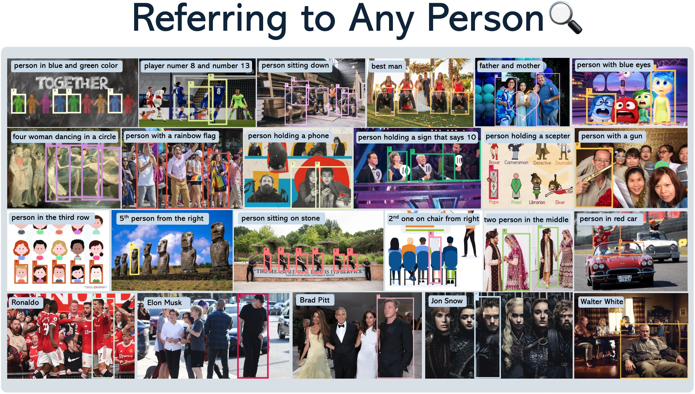
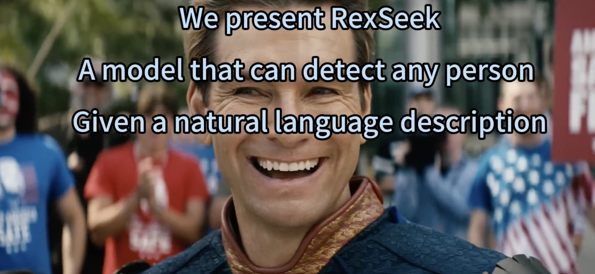
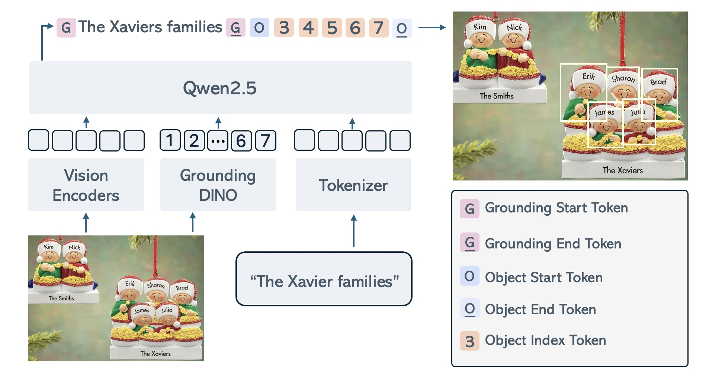
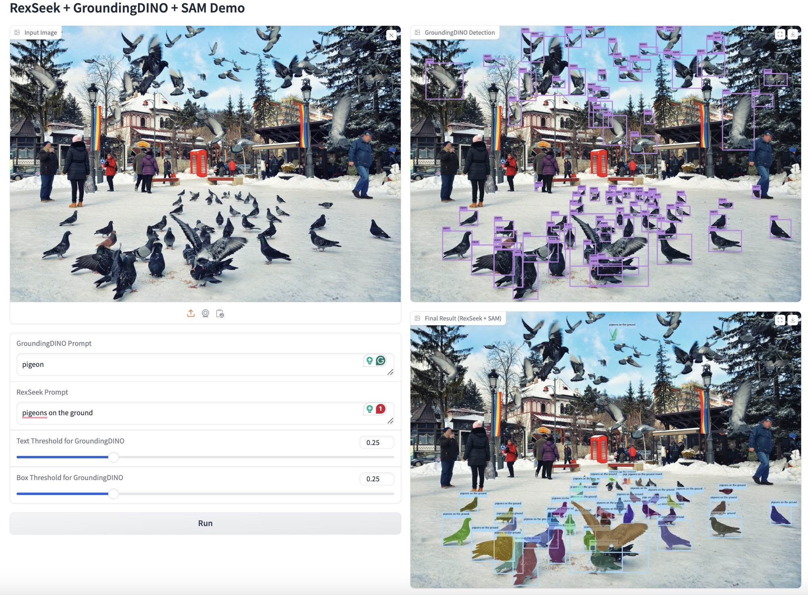
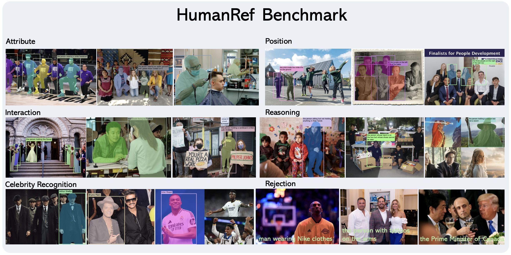

<div align=center>
  
</div>


<div align=center>

 [](https://arxiv.org/abs/2503.08507)  [](https://hits.seeyoufarm.com)[](https://deepdataspace.com/blog/dino-xseek) [](https://cloud.deepdataspace.com/playground/dino-x)

</div>

----

# Contents
- [Contents](#contents)
- [1. Introduction 📚](#1-introduction-)
- [2. Installation 🛠️](#2-installation-️)
  - [2.1 Download Pre-trained Models](#21-download-pre-trained-models)
  - [2.2 Verify Installation](#22-verify-installation)
- [3. Usage 🚀](#3-usage-)
  - [3.1 Model Architecture](#31-model-architecture)
  - [3.2 Combine RexSeek with GroundingDINO](#32-combine-rexseek-with-groundingdino)
    - [3.2.1 Install GroundingDINO](#321-install-groundingdino)
    - [3.2.2 Run the Demo](#322-run-the-demo)
  - [3.3 Combine RexSeek with GroundingDINO and Spacy](#33-combine-rexseek-with-groundingdino-and-spacy)
    - [3.3.1 Install Dependencies](#331-install-dependencies)
    - [3.3.2 Run the Demo](#332-run-the-demo)
  - [3.4 Combine RexSeek with GroundingDINO, Spacy and SAM](#34-combine-rexseek-with-groundingdino-spacy-and-sam)
    - [3.4.1 Install Dependencies](#341-install-dependencies)
    - [3.4.2 Run the Demo](#342-run-the-demo)
- [4. Gradio Demos 🎨](#4-gradio-demos-)
  - [4.1 Gradio Demo for RexSeek + GroundingDINO + SAM](#41-gradio-demo-for-rexseek--groundingdino--sam)
- [5. HumanRef Benchmark](#5-humanref-benchmark)
  - [5.1 Download](#51-download)
  - [5.2 Visualization](#52-visualization)
  - [5.3 Evaluation](#53-evaluation)
    - [5.3.1 Metrics](#531-metrics)
    - [5.3.2 Evaluation Script](#532-evaluation-script)
    - [5.3.3 Evaluate RexSeek](#533-evaluate-rexseek)
- [6. LICENSE](#6-license)
- [BibTeX 📚](#bibtex-)

----

# 1. Introduction 📚
RexSeek is a Multimodal Large Language Model (MLLM) designed to detect people or objects in images based on natural language descriptions. Unlike traditional referring models that focus on single-instance detection, RexSeek excels at multi-instance referring tasks - identifying multiple people or objects that match a given description.

### Key Features
- **Multi-Instance Detection**: Can identify multiple matching instances in a single image
- **Robust Perception**: Powered by state-of-the-art person detection models
- **Strong Language Understanding**: Leverages advanced LLM capabilities for complex description comprehension

### The HumanRef Benchmark
We also introduce HumanRef Benchmark, a comprehensive benchmark for human-centric referring tasks containing:
- 6000 referring expressions
- Average of 2.2 instances per expression
- Covers 6 key aspects of human referring:
  - Attributes (gender, age, clothing, etc.)
  - Position (spatial relationships)
  - Interaction (human-to-human, human-to-object)
  - Reasoning (multi-step inference)
  - Celebrity Recognition
  - Rejection (hallucination detection)


[](https://github.com/user-attachments/assets/e77ffd20-a26b-418d-8ae8-48565bfefdc7)

----

# 2. Installation 🛠️
```bash
conda create -n rexseek CUDA_VISIBLE_DEVICES=0 python=3.10
conda activate rexseek
pip install torch==2.1.2 torchvision==0.16.2 --index-url https://download.pytorch.org/whl/cu121
pip install -v -e .
```

## 2.1 Download Pre-trained Models
We provide model checkpoints for ***RexSeek-3B***. You can download the pre-trained models from the following links:
- [RexSeek-3B Checkpoint](https://huggingface.co/IDEA-Research/RexSeek-3B)

Or you can also using the following command to download the pre-trained models:
```bash
# Download RexSeek checkpoint from Hugging Face
git lfs install
git clone https://huggingface.co/IDEA-Research/RexSeek-3B IDEA-Research/RexSeek-3B
```

## 2.2 Verify Installation
To verify the installation, run the following command:
```bash
CUDA_VISIBLE_DEVICES=0 python tests/test_local_load.py
```

If the installation is successful, you will get a visualization image in `tests/images` folder.

# 3. Usage 🚀
## 3.1 Model Architecture
<div align=center>
  
</div>

**TL;DR**: ***RexSeek needs model to propose object boxes first, then use the LLM to detect the objects.***

RexSeek consists of three key components:
1. **Vision Encoders**: Dual-resolution feature extraction (CLIP + ConvNeXt)
2. **Person Detector**: DINO-X for generating high-quality object proposals
3. **Language Model**: Qwen2.5 for understanding complex referring expressions

- **Inputs**:
  - Image: The source image containing people/objects
  - Text: Natural language description of target objects
  - Boxes: Object proposals from DINO-X detector (can be replaced with custom boxes)

- **Outputs**:
  - Object indices corresponding to the referring expression in format:
    ```
    <ground>referring text</ground><objects><obj1><obj2>...</objects>
    ```

## 3.2 Combine RexSeek with GroundingDINO 
In this example, we will use GroundingDINO to generate object proposals, and then use RexSeek to detect the objects.

### 3.2.1 Install GroundingDINO
```bash
cd demos/
git clone https://github.com/IDEA-Research/GroundingDINO.git
cd GroundingDINO
pip install -v -e .
pip install numpy==1.26.4
mkdir weights
wget -q https://github.com/IDEA-Research/GroundingDINO/releases/download/v0.1.0-alpha/groundingdino_swint_ogc.pth -P weights
cd ../../../
```

### 3.2.2 Run the Demo
```bash
CUDA_VISIBLE_DEVICES=0 python demos/rexseek_grounding_dino.py \
    --image demos/demo_images/demo1.jpg \
    --output demos/demo_images/demo1_result.jpg \
    --referring "person that is giving a proposal" \
    --objects "person" \
    --text-threshold 0.25 \
    --box-threshold 0.25
```

## 3.3 Combine RexSeek with GroundingDINO and Spacy
In previous example, we need to explicitly specify object categories (like "person") for GroundingDINO to detect. However, we can make this process more automatic by using Spacy to extract nouns from the question as detection targets.

### 3.3.1 Install Dependencies
```bash
pip install spacy
CUDA_VISIBLE_DEVICES=0 python -m spacy download en_core_web_sm
```

### 3.3.2 Run the Demo
```bash
CUDA_VISIBLE_DEVICES=0 python demos/rexseek_grounding_dino_spacy.py \
    --image demos/demo_images/demo1.jpg \
    --output demos/demo_images/demo1_result.jpg \
    --referring "person that is giving a proposal" \
    --text-threshold 0.25 \
    --box-threshold 0.25  
```

In this enhanced version:
- No need to specify `--objects` parameter
- Spacy automatically extracts nouns ("people", "shirts", "dogs", "park") from the question
- GroundingDINO uses these extracted nouns as detection targets
- More flexible and natural interaction through questions


## 3.4 Combine RexSeek with GroundingDINO, Spacy and SAM
In this example, we will use GroundingDINO to generate object proposals, then use Spacy to extract nouns from the question as detection targets, and finally use SAM to segment the objects.

### 3.4.1 Install Dependencies
```bash
cd demos/
git clone git@github.com:facebookresearch/segment-anything.git
cd segment-anything
pip install -e .
mkdir weights
wget -q https://dl.fbaipublicfiles.com/segment_anything/sam_vit_h_4b8939.pth -P weights
cd ../../../
```

### 3.4.2 Run the Demo
```bash
CUDA_VISIBLE_DEVICES=0 python demos/rexseek_grounding_dino_spacy_sam.py \
    --image demos/demo_images/demo1.jpg \
    --output demos/demo_images/demo1_result.jpg \
    --referring "person that is giving a proposal" \
    --text-threshold 0.25 \
    --box-threshold 0.25
```

# 4. Gradio Demos 🎨

## 4.1 Gradio Demo for RexSeek + GroundingDINO + SAM
We provide a gradio demo for RexSeek + GroundingDINO + SAM. You can run the following command to start the gradio demo:
```bash
CUDA_VISIBLE_DEVICES=0 python demos/gradio_demo.py \
    --rexseek-path "IDEA-Research/RexSeek-3B" \
    --gdino-config "demos/GroundingDINO/groundingdino/config/GroundingDINO_SwinT_OGC.py" \
    --gdino-weights "demos/GroundingDINO/weights/groundingdino_swint_ogc.pth" \
    --sam-weights "demos/segment-anything/weights/sam_vit_h_4b8939.pth"
```

<div align=center>
  
</div>

# 5. HumanRef Benchmark

<div align=center>
  
</div>

HumanRef is a large-scale human-centric referring expression dataset designed for multi-instance human referring in natural scenes. Unlike traditional referring datasets that focus on one-to-one object referring, HumanRef supports referring to multiple individuals simultaneously through natural language descriptions.

Key features of HumanRef include:

- **Multi-Instance Referring**: A single referring expression can correspond to multiple individuals, better reflecting real-world scenarios
- **Diverse Referring Types**: Covers 6 major types of referring expressions:
  - Attribute-based (e.g., gender, age, clothing)
  - Position-based (relative positions between humans or with environment)
  - Interaction-based (human-human or human-environment interactions)
  - Reasoning-based (complex logical combinations)
  - Celebrity Recognition
  - Rejection Cases (non-existent references)
- **High-Quality Data**:
  - 34,806 high-resolution images (>1000×1000 pixels)
  - 103,028 referring expressions in training set
  - 6,000 carefully curated expressions in benchmark set
  - Average 8.6 persons per image
  - Average 2.2 target boxes per referring expression

The dataset aims to advance research in human-centric visual understanding and referring expression comprehension in complex, multi-person scenarios.

## 5.1 Download
You can download the HumanRef Benchmark at [https://huggingface.co/datasets/IDEA-Research/HumanRef](https://huggingface.co/datasets/IDEA-Research/HumanRef).

## 5.2 Visualization
HumanRef Benchmark contains 6 domains, each domain may have multiple sub-domains.

| Domain | Subdomain | Num Referrings |
|--------|-----------|--------|
| attribute | 1000_attribute_retranslated_with_mask | 1000 |
| position | 500_inner_position_data_with_mask | 500 |
| position | 500_outer_position_data_with_mask | 500 |
| celebrity | 1000_celebrity_data_with_mask | 1000 |
| interaction | 500_inner_interaction_data_with_mask | 500 |
| interaction | 500_outer_interaction_data_with_mask | 500 |
| reasoning | 229_outer_position_two_stage_with_mask | 229 |
| reasoning | 271_positive_then_negative_reasoning_with_mask | 271 |
| reasoning | 500_inner_position_two_stage_with_mask | 500 |
| rejection | 1000_rejection_referring_with_mask | 1000 |

To visualize the dataset, you can run the following command:

```bash
CUDA_VISIBLE_DEVICES=0 python rexseek/tools/visualize_humanref.py \
    --anno_path "IDEA-Research/HumanRef/annotations.jsonl" \
    --image_root_dir "IDEA-Research/HumanRef/images" \
    --domain_name "attribute" \ # attribute, position, interaction, reasoning, celebrity, rejection
    --sub_domain_name "1000_attribute_retranslated_with_mask" \ # 1000_attribute_retranslated_with_mask, 500_inner_position_data_with_mask, 500_outer_position_data_with_mask, 1000_celebrity_data_with_mask, 500_inner_interaction_data_with_mask, 500_outer_interaction_data_with_mask, 229_outer_position_two_stage_with_mask, 271_positive_then_negative_reasoning_with_mask, 500_inner_position_two_stage_with_mask, 1000_rejection_referring_with_mask
    --vis_path "IDEA-Research/HumanRef/visualize" \
    --num_images 50 \
    --vis_mask True # True, False
```

## 5.3 Evaluation
### 5.3.1 Metrics

We evaluate the referring task using three main metrics: Precision, Recall, and DensityF1 Score.

#### Basic Metrics
- **Precision & Recall**: For each referring expression, a predicted bounding box is considered correct if its IoU with any ground truth box exceeds a threshold. Following COCO evaluation protocol, we report average performance across IoU thresholds from 0.5 to 0.95 in steps of 0.05.

- **Point-based Evaluation**: For models that only output points (e.g., Molmo), a prediction is considered correct if the predicted point falls within the mask of the corresponding instance. Note that this is less strict than IoU-based metrics.

- **Rejection Accuracy**: For the rejection subset, we calculate:
  ```
  Rejection Accuracy = Number of correctly rejected expressions / Total number of expressions
  ```
  where a correct rejection means the model predicts no boxes for a non-existent reference.

#### DensityF1 Score
To penalize over-detection (predicting too many boxes), we introduce the DensityF1 Score:

```
DensityF1 = (1/N) * Σ [2 * (Precision_i * Recall_i)/(Precision_i + Recall_i) * D_i]
```

where D_i is the density penalty factor:

```
D_i = min(1.0, GT_Count_i / Predicted_Count_i)
```

where:
- N is the number of referring expressions
- GT_Count_i is the total number of persons in image i
- Predicted_Count_i is the number of predicted boxes for referring expression i

This penalty factor reduces the score when models predict significantly more boxes than the actual number of people in the image, discouraging over-detection strategies.

### 5.3.2 Evaluation Script
#### Prediction Format
Before running the evaluation, you need to prepare your model's predictions in the correct format. Each prediction should be a JSON line in a JSONL file with the following structure:

```json
{
  "id": "image_id",
  "extracted_predictions": [[x1, y1, x2, y2], [x1, y1, x2, y2], ...]
}
```

Where:
- id: The image identifier matching the ground truth data
- extracted_predictions: A list of bounding boxes in [x1, y1, x2, y2] format or points in [x, y] format

For rejection cases (where no humans should be detected), you should either:
- Include an empty list: "extracted_predictions": []
- Include a list with an empty box: "extracted_predictions": [[]]

#### Running the Evaluation
You can run the evaluation script using the following command:
```bash
CUDA_VISIBLE_DEVICES=0 python rexseek/metric/recall_precision_densityf1.py \
  --gt_path IDEA-Research/HumanRef/annotations.jsonl \
  --pred_path path/to/your/predictions.jsonl \
  --pred_names "Your Model Name" \
  --dump_path IDEA-Research/HumanRef/evaluation_results/your_model_results
```

Parameters:
- --gt_path: Path to the ground truth annotations file
- --pred_path: Path to your prediction file(s). You can provide multiple paths to compare different models
- --pred_names: Names for your models (for display in the results)
- --dump_path: Directory to save the evaluation results in markdown and JSON formats

Evaluating Multiple Models:

To compare multiple models, provide multiple prediction files:

```bash
CUDA_VISIBLE_DEVICES=0 python rexseek/metric/recall_precision_densityf1.py \
  --gt_path IDEA-Research/HumanRef/annotations.jsonl \
  --pred_path model1_results.jsonl model2_results.jsonl model3_results.jsonl \
  --pred_names "Model 1" "Model 2" "Model 3" \
  --dump_path IDEA-Research/HumanRef/evaluation_results/comparison
```

#### Programmatic Usage
```CUDA_VISIBLE_DEVICES=0 python
from rexseek.metric.recall_precision_densityf1 import recall_precision_densityf1

recall_precision_densityf1(
    gt_path="IDEA-Research/HumanRef/annotations.jsonl",
    pred_path=["path/to/your/predictions.jsonl"],
    dump_path="IDEA-Research/HumanRef/evaluation_results/your_model_results"
)
```

### 5.3.3 Evaluate RexSeek

First we need to run the following command to generate the predictions:
```bash
CUDA_VISIBLE_DEVICES=0 python rexseek/evaluation/evaluate_rexseek.py \
    --model_path IDEA-Research/RexSeek-3B \
    --image_folder IDEA-Research/HumanRef/images \
    --question_file IDEA-Research/HumanRef/annotations.jsonl \
    --answers_file IDEA-Research/HumanRef/evaluation_results/eval_rexseek/RexSeek-3B_results.jsonl \
```

Then we can run the following command to evaluate the RexSeek model:
```bash
python rexseek/metric/recall_precision_densityf1.py \
  --gt_path IDEA-Research/HumanRef/annotations.jsonl \
  --pred_path  IDEA-Research/HumanRef/evaluation_results/eval_rexseek/RexSeek-3B_results.jsonl\
  --pred_names "RexSeek-3B" \
  --dump_path IDEA-Research/HumanRef/evaluation_results/comparison
```

# 6. LICENSE

RexSeek is licensed under the IDEA License 1.0, Copyright (c) IDEA. All Rights Reserved. Note that this project utilizes certain datasets and checkpoints that are subject to their respective original licenses. Users must comply with all terms and conditions of these original licenses including but not limited to the:
- [OpenAI Terms of Use](https://openai.com/policies/terms-of-use) for the dataset. 
- For the LLM used in this project, the model is [Qwen/Qwen2.5-3B-Instruct](https://huggingface.co/Qwen/Qwen2.5-3B-Instruct), which is licensed under [Qwen RESEARCH LICENSE AGREEMENT](https://huggingface.co/Qwen/Qwen2.5-3B-Instruct/blob/main/LICENSE).
- For the high resolution vision encoder, we are using [laion/CLIP-convnext_large_d.laion2B-s26B-b102K-augreg](https://huggingface.co/laion/CLIP-convnext_large_d.laion2B-s26B-b102K-augreg) which is licensed under [MIT LICENSE](https://huggingface.co/datasets/choosealicense/licenses/blob/main/markdown/mit.md).
- For the low resolution vision encoder, we are using [openai/clip-vit-large-patch14](https://huggingface.co/openai/clip-vit-large-patch14) which is licensed under [MIT LICENSE](https://github.com/openai/CLIP/blob/main/LICENSE)
# BibTeX 📚
```
@misc{jiang2025referringperson,
      title={Referring to Any Person}, 
      author={Qing Jiang and Lin Wu and Zhaoyang Zeng and Tianhe Ren and Yuda Xiong and Yihao Chen and Qin Liu and Lei Zhang},
      year={2025},
      eprint={2503.08507},
      archivePrefix={arXiv},
      primaryClass={cs.CV},
      url={https://arxiv.org/abs/2503.08507}, 
}
```
